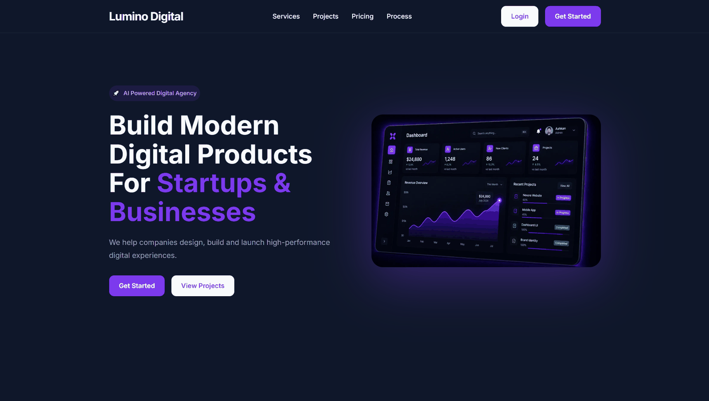
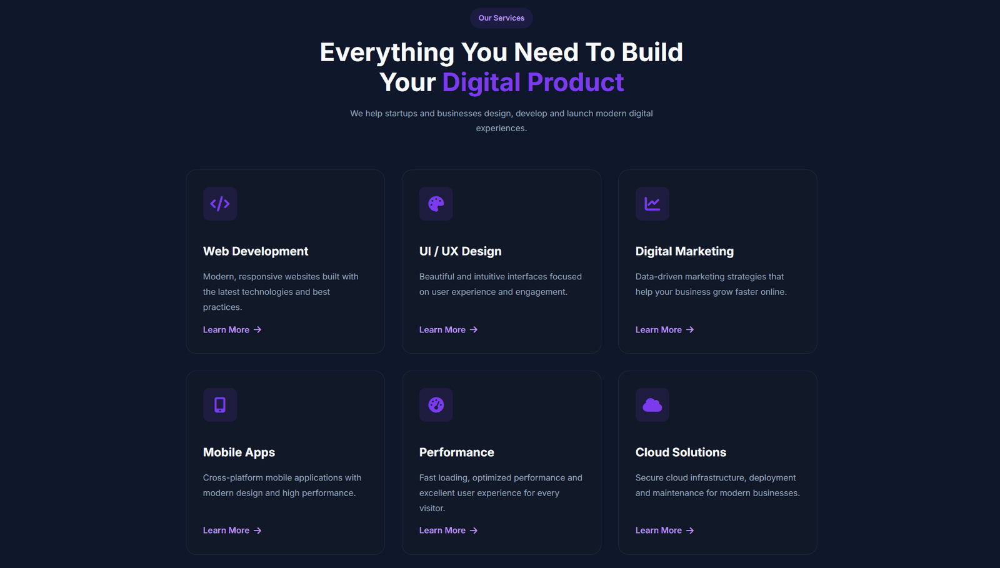
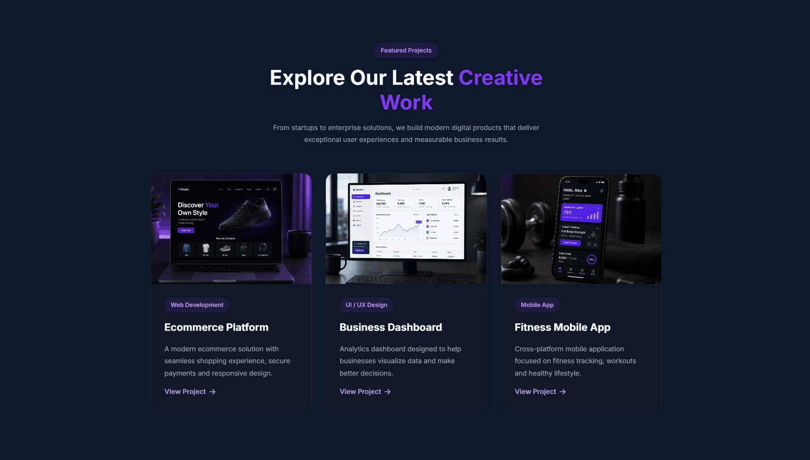
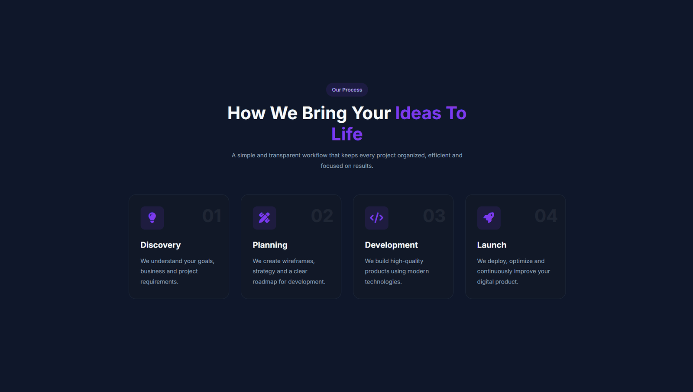
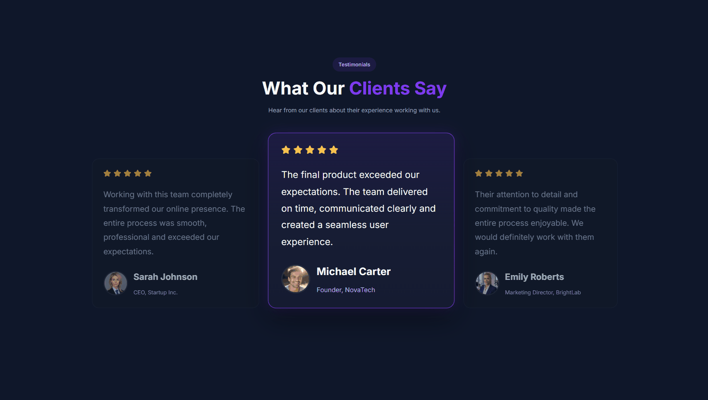
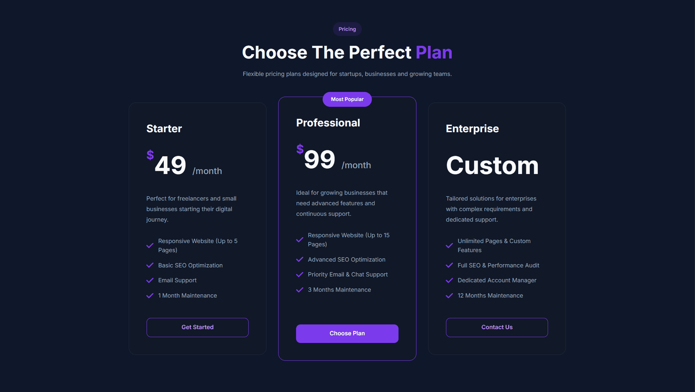
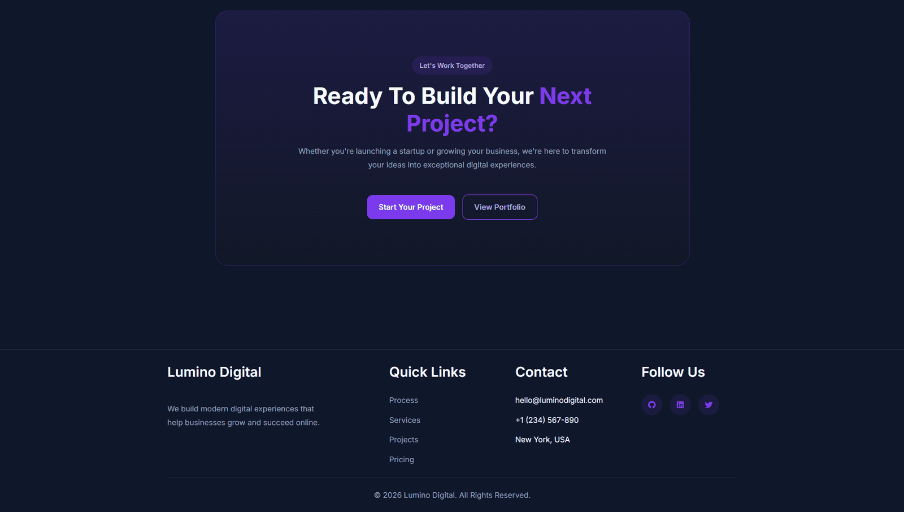

# Lumino Digital

A modern, fully responsive digital agency landing page built with **pure HTML5 and CSS3** — no JavaScript, no frameworks, no build tools.



## ✨ Overview

Lumino Digital is a single-page marketing site for a fictional digital agency. It showcases services, featured projects, a working process timeline, client testimonials, and pricing plans — designed to demonstrate strong CSS fundamentals: layout systems, design tokens, and a real responsive strategy across five breakpoints.

### Sections

| Section | What it shows |
|---|---|
| **Hero** | Headline, CTA buttons and a dashboard mockup visual |
| **Services** | 6 service cards (Web Development, UI/UX Design, Digital Marketing, Mobile Apps, Performance, Cloud Solutions) |
| **Featured Projects** | 3 case-study cards (Ecommerce Platform, Business Dashboard, Fitness Mobile App) |
| **Process** | 4-step workflow — Discovery, Planning, Development, Launch |
| **Testimonials** | 3 client quotes with a highlighted/active center card |
| **Pricing** | 3 plans — Starter ($49/mo), Professional ($99/mo, "Most Popular"), Enterprise (Custom) |
| **CTA + Footer** | Closing call-to-action, brand blurb, quick links, contact info and social links |

## 📸 Screenshots

| Hero | Services |
|---|---|
|  |  |

| Featured Projects | Process |
|---|---|
|  |  |

| Testimonials | Pricing |
|---|---|
|  |  |

| CTA & Footer |
|---|
|  |

## 🛠 Built With

- **HTML5** — semantic markup (`header`, `nav`, `main`, `section`, `article`, `footer`)
- **CSS3**
  - Flexbox & CSS Grid for layout
  - CSS Custom Properties (design tokens for color, spacing, radius, typography)
  - BEM naming convention
  - Pure-CSS mobile navigation (checkbox hack — no JavaScript)
- **Font Awesome 6** (icons, via CDN)
- **Google Fonts** — Inter

## 📱 Responsive Breakpoints

| Breakpoint | Target |
|---|---|
| `1440px` | Testimonial cards stack (avoids overflow on laptops) |
| `1200px` | Container width tightened |
| `1024px` | Tablets — grids drop to 2 columns |
| `768px`  | Mobile navigation kicks in, grids go single-column |
| `480px`  | Small phones — typography and spacing scale down |

## 📂 Project Structure

```
LuminoDigital/
├── index.html
├── favicon.ico
├── css/
│   ├── base.css          # Reset, design tokens, base element styles
│   ├── layout.css        # Container & section spacing
│   ├── components.css    # All UI components (navbar, cards, buttons, etc.)
│   └── responsive.css    # Media queries, mobile-first overrides
├── assets/
│   ├── images/           # WebP images (hero, projects, avatars, favicon)
│   └── screenshots/      # README preview screenshots (not used by the site itself)
├── README.md
└── LICENSE
```

## 🚀 Getting Started

No build step required.

```bash
git clone https://github.com/<your-username>/LuminoDigital.git
cd LuminoDigital
```

Then just open `index.html` in your browser, or serve it locally:

```bash
npx serve .
```

## 🔗 Live Demo

> Add your GitHub Pages / Netlify / Vercel link here once deployed.

## 🩹 Fixed in this revision

A full code review surfaced and fixed the following:

- Mobile nav checkbox is keyboard-focusable again (`sr-only` instead of `display:none`)
- Testimonial cards no longer get clipped on desktop screens wider than 1440px (container/min-width mismatch)
- `Learn More` / nav / footer link colors now meet WCAG AA contrast (4.5:1) on dark backgrounds
- All images have explicit `width`/`height` to prevent layout shift
- `og:image` / `twitter:image` now use absolute URLs so link previews render correctly
- Pricing card `$` amounts render consistently, and each plan now lists distinct features
- `favicon.png` fallback added alongside the WebP icon
- Removed unused CSS custom properties (`--h3`, `--space-10`, `--radius-sml`) and de-duplicated repeated color/shadow values into shared tokens (`--primary-rgb`, `--primary-text`, `--shadow-md/lg/glow`)

## 🩹 Fixed in the accessibility / cleanup pass

- All decorative `<i>` icons (service & process badges, pricing checkmarks, footer social icons) now carry `aria-hidden="true"` so screen readers skip them instead of announcing meaningless icon-font glyphs
- Testimonial star ratings now expose a real accessible name (`role="img" aria-label="Rated 5 out of 5 stars"`) instead of 5 unlabeled icons
- The 🚀 emoji in the hero badge is marked `aria-hidden="true"` (its meaning is already conveyed by the adjacent visible text)
- Added `target="_blank" rel="noopener noreferrer"` to the footer social links so they're safe once real profile URLs are added
- Added `<meta name="robots">` and `<meta name="theme-color">`
- Removed two more dead CSS custom properties (`--space-1`, `--body`) that were defined but never referenced
- `.navbar__burger`'s `z-index` in `responsive.css` now reuses the `--z-nav-toggle` token from `base.css` instead of a duplicated hardcoded `30`
- Verified: HTML tags are balanced, every `` has `alt`, heading order is a clean `h1 → h2 → h3` with no skipped levels, and all text/background color pairs pass WCAG AA contrast

## 📝 Notes

This is a static design showcase — buttons and links (`Get Started`, `Learn More`, `View Project`, etc.) are placeholders (`href="#"`) and are not wired to a backend.

## 📄 License

This project is a personal portfolio piece — all rights reserved. See [LICENSE](./LICENSE) for details.
